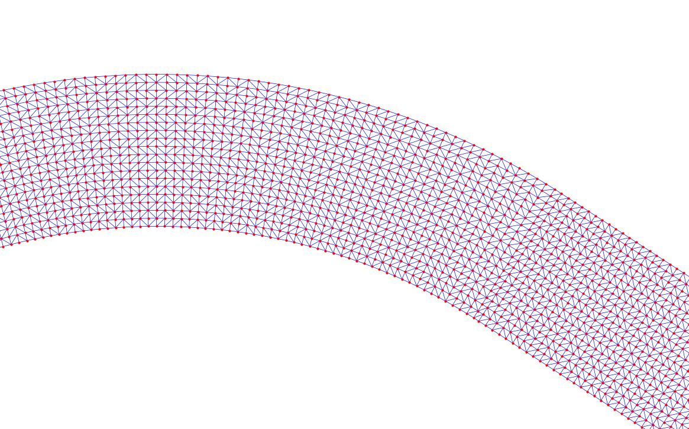

# Segmental environment generator for inland waterways



## Description

Implementation of the generator used in [Paulig and Okhrin (2024)](https://doi.org/10.1016/j.oceaneng.2024.117207).

This generator constructs arbitrary river-like point grids to be used as training and testing environments for simulation-based maritime applications. The generator alternates between straight and curved segments to construct a river. Currents and water depths are assigned to each grid point based on its parameters. The generator can be used as a standalone module or as part of a script.

## Installation

You can install the package via

```console
$ pip install git+https://github.com/nikpau/sr-gen.git
```

## Usage

This generator can be called as a Python module from the command line for standalone use or can be part of a script.

In any case you need to provide a configuration file in `yaml` format. It specifies the parameters for the river generation process.
> The configuration file must contain all fields from the example for the generator to work. In depth explanations of the parameters can be found in the [Configuration files](#configuration-files) section. 

In its default configuration, the generator will utilize the `csv` exporter, which generates three `.csv` files:
1. `coords.csv` containing the coordinates of the river segments
2. `metrics.csv` containing the water depth, current direction, and current velocity at each grid point.
3. `Segments.txt` containing the segment types used for the generation and their parameters.

The exporter can be changed by specifying the `EXPORTER` field in the configuration file. The available exporters are defined in `src/rivergen/exporters.py`. Currently, the available exporters are:

### CSV Exporter
- Generates two `.csv` files and one `.txt` file:
  1. `coords.csv`
  2. `metrics.csv`
  3. `Segments.txt`

### UCD Exporter
- Generates a single UCD compliant file and one `.txt` file:
  1. `generated.inp` contatining the river geometry and its accompanying metrics in UCD format. The mesh triangulation used a contrained Delaunay triangulation using triangles. Other mesh types are not supported natively, but can be added by modifying the `src/rivergen/export.py:UCDExporter::write_to_file()` method.
  2. `Segments.txt` 

Custom exporters can easily be generated. The blueprint for creating a custom exporter can be found under `./src/rivergen/utils.py` in the `BaseExporter` class.

### CLI
```console
$ rivergen -c /path/to/config.yaml
```
You can run the module with the default configuration file at `./configs/example.yaml` to see an example of the building process.

Upon running, the generator will create a folder at the specified location from the configurations `SAVEPATH` argument. For each call, a new folder is created, named by a random hexadecimal UUID and three. This was done to avoid duplicate folder names when calling the generator rapidly e.g. during neural network training. This behavior can be changed under `src/rivergen/utils.py:99`.

#### Options

In case you want to test a configuration without saving it permanently to disk, consider using the `-tc` flag, which temporarily constructs a river from the given configuration and plots it for visual inspection. After closing the plot window, the constructed river is deleted.

If the visual inspection is desired but the result shall be kept, use the `-vc` flag, which keeps the files after inspection.

### Script

The generator can be included in any script by first registering a configuration and then exporting rivers generated from it to a file. For example:

```python
import rivergen

# Construct a configuration from a yaml file
configuration = rivergen.ConfigFile("/path/to/config.yaml").config

# Create an exporter from the configuration
exporter = configuration.export()

# Generate 10 random rivers from this configuration
# and plot them for inspection
for _ in range(10):
    exportpath = exporter.export_to_file()
    rivergen.tests.visualize(exportpath,configuration)


```

## Configuration files

The building behavior can be altered via several parameters to be specified inside a `yaml` configuration file. Details about the parameters and the generation process can be found at [Paulig and Okhrin (2024)](https://doi.org/10.1016/j.oceaneng.2024.117207).

A possible configuration could look like this:

```yaml
NSEGMENTS: 10 # Total number of segements
CANAL: False # If true, the river will be a straight canal (ANGLES and RADII will be ignored)
GP: 50 #  No. of grid points per segment width
BPD: 20 # distance between gridpoints [m]
LENGTHS: # Range for straight segments [m] (ξ)
  LOW: 400
  HIGH: 2000
RADII: # Range of circle radii [m] (r)
  LOW: 500
  HIGH: 2000
ANGLES: # Range of angles along the circles [deg] (ϕ)
  LOW: 60
  HIGH: 80
MAX_DEPTH: 7 # River depth at deepest point [m] (κ)
MAX_VEL: 1 # Maximum current velocity [ms⁻¹] (ν)
VARIANCE: 2 # Variance for current and depth rng

# Path to the directory where the
# generated files will be saved.
# Absolute paths are recommended.
SAVEPATH: "/path/to/save/"

# Name of the exporter class to use.
# Exporters are defined in ./src/rivergen/exporters.py
# and determine the file format of the generated
# river.
EXPORTER: "csv"

# Print information about the generation 
# process to stdout
VERBOSE: True
```
> The configuration file must contain all fields from the example for the generator to work.
